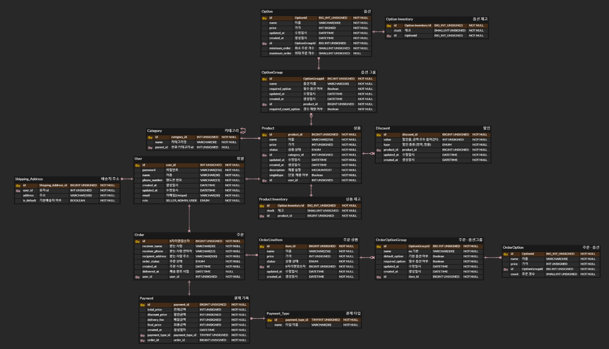

# FreshCart
소개: 신선 식품을 판매하는 e-commerce 서비스 입니다. 프론트는 생략하고, 백엔드에 초점을 맞춰 개발했습니다.

# 서비스 구조 


# ERD 설계
[ERD 설계](https://www.erdcloud.com/d/ezfSvS66CSxhzFp8o)




# 기능 명세서
[기능 명세서](https://github.com/f-lab-edu/FreshCart/wiki/%EA%B8%B0%EB%8A%A5-%EB%AA%85%EC%84%B8%EC%84%9C)

# 기타

Elastic APM Java Agent 설정

APM 설정 - 인텔리제이 Edit Configurations -> VM Options 에 추가 (Run 시 실행됨)
```
-javaagent:/{jar 파일의 위치}/elastic-apm-agent-1.34.1.jar
-Delastic.apm.disable_send=false
-Delastic.apm.environment=local
-Delastic.apm.service_name=freshcart
-Delastic.apm.enable_log_correlation=true
-Delastic.apm.application_packages=com.example.freshcart
-Delastic.apm.trace_methods_duration_threshold=1ms
-Delastic.apm.transaction_sample_rate=1
-Delastic.apm.server_urls=http://localhost:8200
-Delastic.apm.secret_token=
-Delastic.apm.span_frames_min_duration=1ms
-Delastic.apm.span_min_duration=0ms
-Delastic.apm.trace_methods=com.example.freshcart.*
-Delastic.apm.max_queue_size=2048

```
