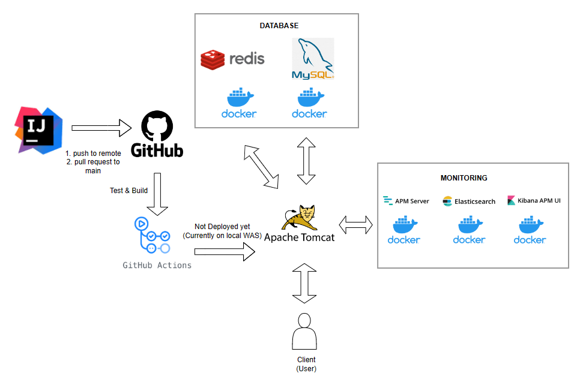

# FreshCart
소개: 신선 식품을 판매하는 e-commerce 서비스 입니다.
다양한 옵션을 
프론트는 생략하고, 백엔드에 초점을 맞춰 개발했습니다.

# 사용 기술 스택
- Java 11, Spring Boot, Gradle 
- JPA, MyBatis
- MySQL, Flyway
- Redis Clustering
- Docker
- ElasticSearch
- Github Actions 

# 서비스 구조 



# 프로젝트 의도 

- 변경과 확장(scale-out)에 유연하도록 설계 하였습니다. 
- 인증/인가 시 AOP 를 활용하여, 반복적인 코드를 줄였습니다.
- 여러 기술의 장단점을 비교하고 사용해본 뒤, 상황에 맞는 기술을 쓰고자했습니다.
- 학습 목적의 프로젝트이기 때문에, 기술의 개발 의도를 이해하고 깊이 있게 써보고 싶었습니다. 
이를 위해 인증 기능에 사용되는 HttpSession, 스프링 시큐리티 등을 사용하지 않고 직접 구현 했습니다.

# 트러블 슈팅 / 기술 선택 과정 

- [JPA/MYSQL] 재고에 동시 접근할 때 일어나는 갱신 분실 문제 해결하기

  블로그 : [https://writerroom.tistory.com/338](https://writerroom.tistory.com/338)

- 객체 지향적 설계/유지 보수하기 좋은 코드를 위한 고민

  블로그:  [https://writerroom.tistory.com/332](https://writerroom.tistory.com/332)

- Redis로 다중 서버 환경에서 로그인 정보 불일치 문제 해결

  블로그: [https://writerroom.tistory.com/333](https://writerroom.tistory.com/333)

- 로그인 구현 시 세션과 토큰 방식 비교

  블로그: [https://writerroom.tistory.com/320](https://writerroom.tistory.com/320)

- 인터셉터 / 커스텀 애노테이션 활용하여 로그인 강제

  블로그: [https://writerroom.tistory.com/326](https://writerroom.tistory.com/326)

- 협업에 용이한 작업 환경 구성

  블로그: [https://writerroom.tistory.com/336](https://writerroom.tistory.com/336)

- 솔트를 이용해 비밀번호 암호화의 보안 강화

  블로그: [https://writerroom.tistory.com/327](https://writerroom.tistory.com/327)

# ERD 설계
[ERD 설계](https://www.erdcloud.com/d/ezfSvS66CSxhzFp8o)


# 기능 명세서
[기능 명세서](https://github.com/f-lab-edu/FreshCart/wiki/%EA%B8%B0%EB%8A%A5-%EB%AA%85%EC%84%B8%EC%84%9C)

# 기타

Elastic APM Java Agent 설정

APM 설정 - 인텔리제이 Edit Configurations -> VM Options 에 추가 (Run 시 실행됨)
```
-javaagent:/{jar 파일의 위치}/elastic-apm-agent-1.34.1.jar
-Delastic.apm.disable_send=false
-Delastic.apm.environment=local
-Delastic.apm.service_name=freshcart
-Delastic.apm.enable_log_correlation=true
-Delastic.apm.application_packages=com.example.freshcart
-Delastic.apm.trace_methods_duration_threshold=1ms
-Delastic.apm.transaction_sample_rate=1
-Delastic.apm.server_urls=http://localhost:8200
-Delastic.apm.secret_token=
-Delastic.apm.span_frames_min_duration=1ms
-Delastic.apm.span_min_duration=0ms
-Delastic.apm.trace_methods=com.example.freshcart.*
-Delastic.apm.max_queue_size=2048

```
